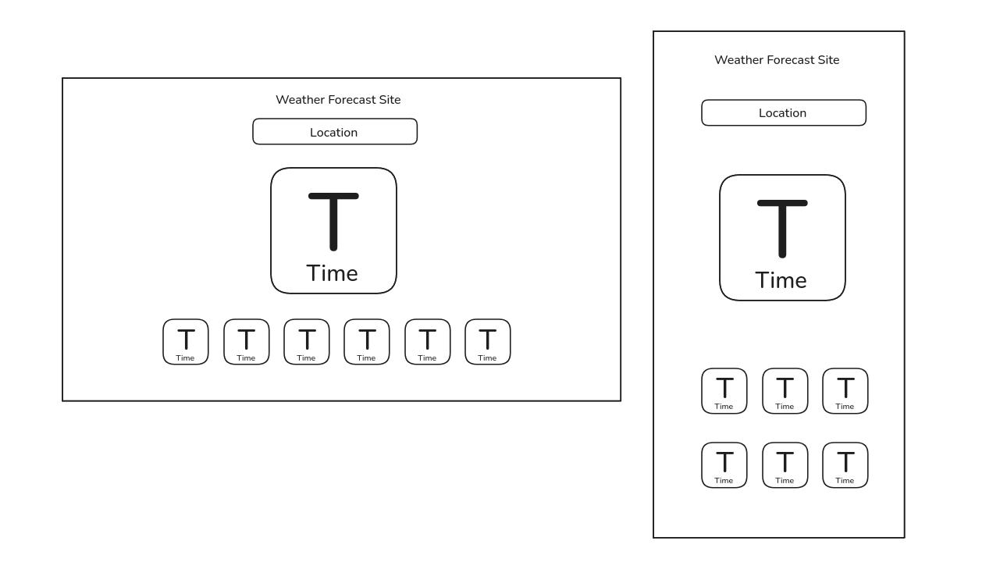

# JavaScript Learning – December 2025

This repository contains my JavaScript learning progress and mini projects for December 2025.

The primary project in this repo is an API-based weather forecast website, built to test and reinforce my understanding of JavaScript fundamentals, asynchronous code, and working with external APIs.

---

## Project: Weather Forecast Website

This is my first complete JavaScript project using real-world APIs.

### Problem Statement

The weather API I chose initially (**Open-Meteo**) requires latitude and longitude coordinates rather than a city name. Since most weather APIs follow this approach, I needed a way to convert user-entered locations into coordinates.

### Solution

To solve this, I integrated a second API (**Geoapify**) that accepts a location name and returns detailed geographic data, including latitude, longitude, and timezone.  
These values are then used to fetch weather data from Open-Meteo.

---

## Development Progress

### Day 1
- Designed a basic UI layout to decide what information to display.
- Planned how the layout should behave on desktop vs mobile.
- Implemented initial API fetching logic.

### Day 2
- Added date, day, and time display.
- Implemented temperature forecast for the next 6 hours.
- Learned practical usage of the `Date` object.
- Used the ternary (`? :`) operator for concise conditional logic.

### Day 3
- Renamed certain IDs (day → hour) for clarity and correctness.
- Improved styling for a more modern appearance.
- Added a loader animation and disabled the search button during API calls.
- Discovered a timezone bug when searching locations outside India, likely due to how `Date` is handled. This is planned to be fixed next.
- Used AI (ChatGPT) to reformat code, add comments, and improve readability.
- Re-wrote readme file to be more precise and clear.

---

## Learnings & Notes

- Gained confidence working with APIs and async JavaScript.
- Learned that exposing API keys directly in client-side code is insecure and should be avoided.
- Identified timezone handling as an important edge case when working with global data.

---

## Next Improvements
- Fix timezone handling for non-local searches.
- Improve error handling (invalid location, API failure).
- Explore secure ways to handle API keys.
